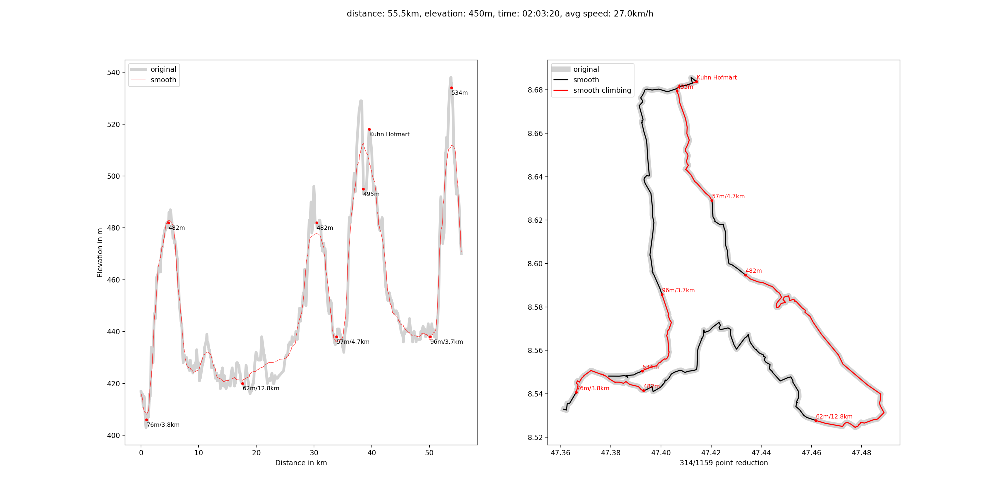

This is a tool implemented in python 3 to generate a tcx file from a gpx.
It'll find any peak and add alerts so you know when it starts and what
kind of hill you're facing.
Garmin finally added this feature automatically when you upload a tcx
file to your device. You might still want to get some information beforehand
without your garmin.


## Installation
```
pyenv virtualenv 3.7.1 gpx
pyenv local gpx
pip install -r requirements.txt
```

## Run
```
python run-py -h # for help
python run.py --speed 27 file.gpx
2019-10-04 13:49:56 - Hello
distance: 55.5km, elevation: 450m, time: 02:03:20, avg speed: 27.0km/h
  1.0km: 76m/3.8km    Valley
  4.8km: 482m         Summit
 17.6km: 62m/12.8km   Valley
 30.5km: 482m         Summit
 33.9km: 57m/4.7km    Valley
 38.5km: 495m         Summit
 39.5km: Kuhn Hofmärt Generic
 50.1km: 96m/3.7km    Valley
 53.8km: 534m         Summit
```

see 

## Of interest
- https://github.com/tkrajina/gpxpy/blob/master/gpxpy/geo.py
